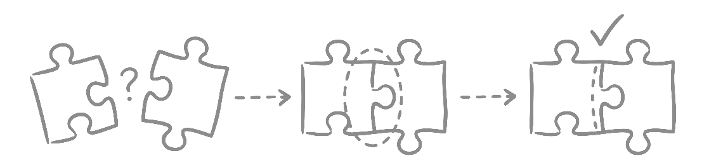

  
  <h1 align="center">Seam Up</h1>

An evolution of [Shape Up](https://basecamp.com/shapeup) for teams where AI agentic coding shifts collaboration from co-construction to co-design of boundaries and contracts.

Shape Up guides you in shaping the work. Seam Up guides you to shape the space _between_ builders.

## Why this exists

AI compresses the gap between thinking and building. One person with AI can carry a meaningful vertical slice from spec to shipped code. Construction isn't the bottleneck anymore -- understanding is. Agreeing on what to build, where one person's work ends and another's begins, and what holds them together.

Most teams feel this shift but don't have a vocabulary for it. Seam Up names the tensions and offers principles and techniques for getting collaboration right when builders are faster and more autonomous than ever.

## Who is this for

Teams that value builder autonomy and are exploring AI-augmented workflows. If you're already doing some version of Shape Up, Basecamp-style shaping, or any process where small empowered teams own their work end-to-end, Seam Up picks up where your building phase begins.

## What's included

### The mini-book

Six chapters covering the thesis, the tensions that motivate it, guiding principles, and practical techniques:

1. [The Thesis](docs/01-thesis.md) - Origin, metaphor, and the core claim
2. [Background](docs/02-background.md) - What Seam Up inherits from Shape Up and what changed
3. [The Tensions](docs/03-tensions.md) - Structural tensions that surface with AI-augmented teams
4. [Guiding Principles](docs/04-principles.md) - How to get collaboration right at the seams
5. [Techniques](docs/05-techniques.md) - Practical techniques for AI-augmented workflows
6. [Getting Started](docs/06-getting-started.md) - How to adopt incrementally

### AI skills

Installable AI agent skills that operationalize the techniques from the book. Each skill gives an AI coding agent a structured workflow for one step of the Seam Up process:

| Skill                                        | What it does                                                                |
| -------------------------------------------- | --------------------------------------------------------------------------- |
| [smup-distill-spec](skills/smup-distill-spec/SKILL.md) | Translate a product spec into a focused engineering spec                    |
| [smup-research](skills/smup-research/SKILL.md)         | Explore the codebase against a spec, surface questions and design ideas     |
| [smup-scope-split](skills/smup-scope-split/SKILL.md)   | Document scope boundaries, design decisions, tradeoffs, and seam agreements |
| [smup-seam-change](skills/smup-seam-change/SKILL.md)   | Draft a proposal when a seam agreement needs to change mid-build            |

Skills are written in plain markdown with no tool-specific API references. They work with [Claude Code](https://docs.anthropic.com/en/docs/claude-code), [OpenCode](https://opencode.ai), and any AI coding tool that supports skill or instruction files. See the [skills README](skills/README.md) for installation instructions.
